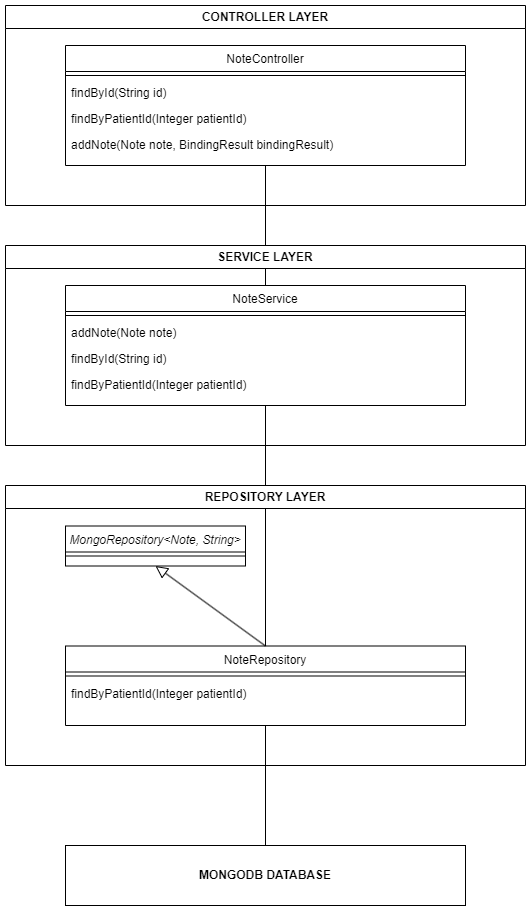

# OC_DA_JAVA_P9_Note

Note microservice for medilabo
<ul>
  <li><a href="https://github.com/SimonArduin/OC_DA_JAVA_P9_Front">Front microservice</a></li>
  <li><a href="https://github.com/SimonArduin/OC_DA_JAVA_P9_Gateway">Gateway microservice</a></li>
  <li><a href="https://github.com/SimonArduin/OC_DA_JAVA_P9_Patient">Patient microservice</a></li>
  <li><a href="https://github.com/SimonArduin/OC_DA_JAVA_P9_Prediction">Prediction microservice</a></li>
  <li><a href="https://github.com/SimonArduin/OC_DA_JAVA_P9_Note">Note microservice</a></li>
</ul>

This application allows users to interact with a MongoDB database through an API.

It is built with Spring as a Maven project, using the following modules :
- Spring Data MongoDB

The application configuration is defined in [application.properties](note/src/main/resources/application.properties). By default, incoming requests are received on port 8001, and the MongoDB database is found on port 27017 with the name medilabo.

***
# CLASS DIAGRAM

